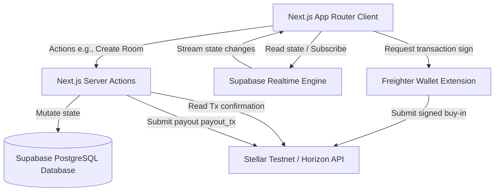

# PAWnic System Architecture

PAWnic is built on a modern serverless blockchain stack. This document details how frontend modules, database sync, and blockchain integration orchestrate real-time multiplayer lobbies.

## Architecture Overview

## System Components

### 1. Next.js App Router Client
* **Landing Screen (`app/page.tsx`)**: Integrates the `@stellar/freighter-api` to connect user wallets, fetch account public keys, and check balances. Manages room creation and room entering using join forms.
* **Game Room (`app/room/[code]/page.tsx`)**: Main multiplayer dashboard. Consists of:
  * **Lobby Panel**: Lists joined players, shows their ready state, and displays buy-in status.
  * **Arena Panel**: Renders active gaming screen, indicating who holds the ticking cat bomb, explosion countdown, and current round.
  * **Shop Panel**: Displays active points balance and buy buttons for in-game modifiers.
  * **Finished Overlay**: Displays round results and payout transaction links.

### 2. Supabase Postgres & Realtime
* **Realtime Sync**: The client initiates Postgres changesets streaming using channels on tables (`rooms`, `players`, `events`). Any mutations in the DB are pushed instantly to all client browsers.
* **Service Role Access**: Database changes (mutating score, updating player status, starting game rounds) are performed via secure Next.js Server Actions (`app/actions/`) executing with Supabase's `service_role` credentials to bypass client RLS policies safely.

### 3. On-Chain Stellar Network
* **Escrow Vault**: Player buy-ins (0.1 XLM minimum) are sent directly to the Stellar Vault Account. The vault operates as a temporary custody holder.
* **Horizon API**: Used during room updates to query and verify transaction hashes submitted by players, ensuring they paid their buy-in fee.
* **Winner Disbursement**: Triggered server-side upon round completion. The system generates a Stellar transaction, signs it with the Vault Secret Key (`STELLAR_VAULT_SECRET_KEY`), and submits it to Horizon, transferring the collected pot (buy-ins minus fee) to the winner.
